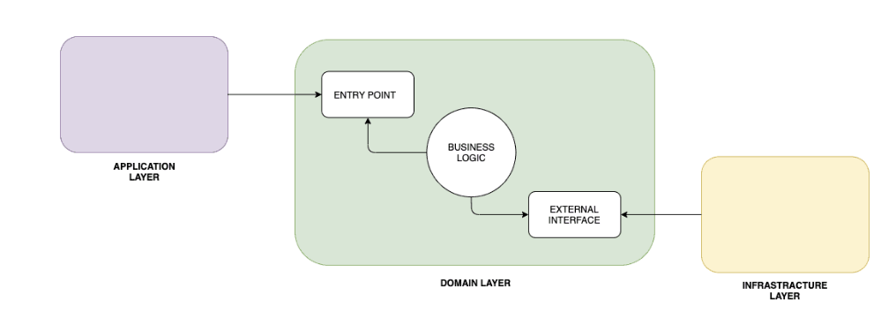

# Challenge – Weather API

## Project Description

**weather-api** is a RESTful service built with Spring Boot that provides weather information based on a ZIP code.  
The API uses public geocoding to convert ZIP codes to coordinates, fetches current weather and forecasts from open providers, and delivers everything as structured JSON.  
To avoid hitting rate limits and speed up responses, results for each ZIP code are cached for 15 minutes.

---
## Technologies Used

- **Java 21** — Latest LTS version, providing modern language features and long-term support.
- **Spring Boot 3.5.x** — Rapid development of production-ready applications.
- **Spring Web** — Building RESTful web services and APIs.
- **Spring Cache (Caffeine)** — Fast, in-memory caching with auto-expiry for improved performance.
- **Spring Boot Actuator** — Application health checks, metrics, and monitoring endpoints.
- **Lombok** — Reduces boilerplate code with annotations (getters, setters, builders, etc.).
- **OpenAPI/Swagger** — Interactive and auto-generated API documentation.
- **Jakarta Bean Validation** — Input validation for fields such as ZIP codes and dates.
- **Resilience4j** — Fault tolerance with retries, circuit breakers, rate limiting, and timeouts for external calls.
- **JUnit, Mockito, WireMock, MockMvc** — Automated unit and integration testing frameworks.
- **Docker** — Containerization for consistent deployment; supports Docker Compose for multi-service orchestration.
- **I18n (Internationalization)** — Multi-language support (Portuguese, English/US).
- **SLF4J with Logback** — Logging framework for structured and configurable logs.
- **RestTemplate** — HTTP client for external API integration.
- **MapStruct** — Annotation processor for type-safe and performant Java bean mapping (if used in your mappers).

## Project Architecture

This project is structured using **Hexagonal Architecture** (also known as *Ports and Adapters*), promoting a clear separation of concerns, testability, and ease of maintainability. The architecture divides the application into three main layers:

#### **Hexagonal Architecture (Ports and Adapters)**
- **Application Layer:** Orchestrates business use cases, interacts with the domain through ports (interfaces).
- **Domain Layer:** Contains the core business logic, models, and interfaces (ports) for inbound and outbound communication.
- **Adapter Layer:** Handles all external interactions, such as HTTP APIs, persistence, and caching. Outbound adapters implement domain ports.

>   
> *Image Source: [Baeldung - Hexagonal Architecture](https://www.baeldung.com/hexagonal-architecture-ddd)*

This layered approach makes the business rules the heart of the application, with all external interactions (like web requests, database, or third-party APIs) passing through well-defined interfaces.

---

### Project Structure

```plaintext
src/main/java/com/weatherapi/
├── adapter/
│   ├── inbound/
│   │   └── web/                        # REST controllers and entry points
│   └── outbound/
│       └── provider/
│           └── forecast/
│               └── AbstractForecastProvider.java
│               ...                     # Forecast provider implementations
│           └── geocode/
│               ...                     # Geocode provider implementations
│       └── executor/
│           └── ForecastApiExecutor.java
│           ...                         # External API executors and infra logic
├── application/
│   └── impl/
│       └── WeatherApplicationServiceImpl.java
│   └── WeatherOrchestratorService.java
│   ...                                 # Use case orchestration and services
├── config/
│   └── CacheConfig.java
│   ...                                 # Configuration classes (cache, beans, etc.)
├── domain/
│   ├── dto/
│   │   ├── request/
│   │   ├── response/
│   ├── enums/
│   ├── exception/
│   ├── mapper/
│   ├── model/
│   ├── port/
│   ├── service/                        # Domain models, mappers, ports, and services
```

**References:**
- [Baeldung - Hexagonal Architecture and Domain-Driven Design](https://www.baeldung.com/hexagonal-architecture-ddd)
- [Hexagonal Architecture Explained (Alistair Cockburn)](https://alistair.cockburn.us/hexagonal-architecture/)

This structure ensures the core domain logic is isolated and easily testable, while external concerns are modular and replaceable.

### Design Strategies and Patterns

This project applies several key software architecture and design principles to ensure maintainability, extensibility, and clear separation of concerns. Here’s an overview of the main strategies and where they are used:

#### **SOLID Principles**
- **Single Responsibility Principle (SRP):**
    - Each class and component has one responsibility. For example, providers only handle communication with external APIs, while orchestrators manage workflow coordination.

    > **E.g:**   
    >> **ForecastApiExecutor**:
            This class only manages external API execution with caching and retry.
            It does not handle business logic, mapping, or request building—those are elsewhere.
- **Open/Closed Principle (OCP):**
    - The system is open for extension but closed for modification. New providers or external API integrations can be added without changing existing logic, thanks to well-defined interfaces.
    > **E.g:** 
    >> **Provider Interfaces & Abstract Classes**
      ForecastProvider and AbstractForecastProvider.
      To add a new forecast provider (e.g., AccuWeather), can be created a new class that implements the interface/extends the abstract class.
      You do not need to modify existing provider logic.
- **Liskov Substitution Principle (LSP):**
    - All provider implementations can be substituted for one another via their interfaces, ensuring consistent behavior.
      > **E.g:**
      >> **All Providers Implement the Same Interface**
      <br />
        Any class implementing ForecastProvider or GeocodeProvider can be used interchangeably by the orchestrator or factory.
        The application doesn't need to know which specific provider it's using.
- **Interface Segregation Principle (ISP):**
    - Interfaces (ports) expose only the methods needed for their use cases, keeping dependencies minimal and focused.
    > **E.g:**
    >> **Focused Interfaces**
    <br />
      ForecastProvider doesn't force providers to implement unrelated methods (e.g., geocode methods).
      Each provider interface only exposes what is needed for that responsibility.
- **Dependency Inversion Principle (DIP):**
    - High-level modules depend on abstractions, not concrete implementations. The application and domain layers interact through interfaces, with concrete implementations supplied by adapters.
    > **E.g:**
    >> **Use of Interfaces and Injection**
    <br />
    WeatherOrchestrator depends on ForecastProvider and GeocodeProvider interfaces, not concrete classes.
    Implementations are injected via Spring, not hardcoded.

#### **Strategy Pattern**
- Used for provider selection and execution. Each provider implements a common interface, and a factory determines which provider to use at runtime based on configuration.

#### **Factory Pattern**
- Factories are used to instantiate the appropriate provider implementation dynamically, allowing the application to be easily extended with new providers without modifying core logic.

#### **Resilience and Caching**
- **Resilience4j** is used in outbound executors to wrap external API calls with retry policies, ensuring fault tolerance.
- **Caffeine Cache** is used for caching results of external requests and minimizing redundant calls.
- Logging and error handling are centralized in the executor and provider layers, with exceptions translated into domain-specific types.

#### **Exception Handling**
- Providers and executors translate infrastructure exceptions (such as HTTP errors) into domain exceptions. Application and controller layers handle these exceptions and return appropriate HTTP responses.

#### **Logging and Observability**
- Logging is implemented at all key integration points, including outbound calls, retry attempts, cache hits/misses, and error scenarios, supporting both debugging and monitoring.

---

These strategies together provide a robust, modular, and testable architecture, following best practices for enterprise-grade Spring Boot applications.

## 📄 Documentation

SpringDoc OpenAPI auto-docs every endpoint:

- [Swagger UI](http://localhost:8083/api/swagger-ui.html) — Interactive docs & try-it-out.
- [OpenAPI JSON](http://localhost:8083/api/v3/api-docs) — For import into Postman/etc.

To use with Postman:
- Go to Import, paste the content of [OpenAPI JSON link](http://localhost:8083/api/v3/api-docs).
- Postman will load all endpoints with schemas/examples automatically.

---
---
## 🔁 Executing locally (without Docker compose):

Requirements

> Java 21

>Maven 3.8+

> (Optional) Docker

### 🧪 Running Integration Tests
From your terminal, just run:
```bash
  ./mvnw clean verify
```
Or, if you don't use Maven Wrapper:

```bash
  mvn clean verify
```

```bash
  mvn clean verify
```

### Compiling
```bash
  mvn clean install -DskipTests
```

```bash
  mvn clean install -DskipTests
```
### Run
```bash
  mvn spring-boot:run
```

# 🚀 Run with Docker Compose

This project is fully containerized using Docker and Docker Compose.
You can build and run the entire Weather API stack with a single command, no local Java or Maven required.

Why Docker Compose?

Standardizes the development and runtime environment across all machines and CI/CD pipelines.

Makes onboarding dead simple: anyone can clone, build, and run in seconds.

Application data is persisted via mounted volumes (data/ → /app/data), keeping things stateless and easy to wipe/reset.

1. **Prerequisites**
- Docker and Docker Compose installed
- Maven (optional, only if you want to build outside the container)

3. **Mount and run with Docker Compose**

```bash
  docker-compose up -d --build
### Build and launch application via command line, safe restart (no logs in terminal)
```

```bash
  docker-compose up --build
### Uploading application via command line without prefixes with logs via terminal
```
```bash
  docker-compose up
### Only launch application via command line line
```

```bash
  docker-compose down -v
### Stopping applications, containers and volumes via the command line
```

```bash
  docker-compose logs
### View application logs
```


4. **Access the application**
- Swagger UI: [http://localhost:8083/api/swagger-ui.html](http://localhost:8083/api/swagger-ui.html)
- API: [http://localhost:8083/api/weather](http://localhost:8083/api/weather)

5. **Notes**
- The data/ folder is mounted as a volume inside the container (/app/data) for local persistence.
- If you change the code, run docker compose up --build to rebuild.
- Application logs go directly to the terminal (stdout).
- To stop everything: docker compose down

---

## ⚙️ HTTP Client & Timeouts

- **RestTemplate** is configured with Apache HttpClient (connection/read timeouts set globally).
- All HTTP config is centralized, so tuning is easy.

---
## About the challenge

---

**Difficulties:**
1. Caching:
    - Spring’s `@Cacheable` doesnt mantain information from cache, is "fire and forget” so i couldn't use only the annotation: it doesn't tell your code if the result was cached or not. For this project, I had to manage the cache set manually to guarantee the `isCached` flag was always accurate in the API response.
    - I used the solution with Caffeine + CacheManager, configuring the rules of the cache within the yml properties and registering the cache name and key to store it
    - I retrieve cache in case registered and insert on the response to show to the user the response was cached

2. Architecture and structure
    - Structuring the service layer to keep orchestration out of the providers, centralizing all business rules for easier testability and future enhancements.
    - Separating providers in order to permit future providers implementation and not share individual business logics, also retrieving common methods centralized on a factory, making easier to handle multiple providers without having to interfere much on code.
    - Define a structure of the services, contracts and mantain a scalable system where I would be able to implement new services
3. Organizing apis information
    - Both apis has a lot of information and posibilities, I had to focus on what was being asked on the challenge and organize everything to not use unuseful information maintaining the project clean and straight
3. Mapping
    - Map some values ( take values from the temperature range information and map to currentTemperature)
    - Mapping external data structures to internal models while maintaining clean separation and avoiding leaks of provider-specific formats.
    - Finding the current temperature and dealing with multiple temperatures
4. Scalability, reusability and maintainability
    - Preparing the codebase and abstracting logic in order to get a maintainable, scalable and reusable structure for **future enhancements** like advanced caching, resilience (e.g., retry logic), and new data sources without major refactoring.
    - I had a lot of problems on the resilience (retry) phase. Due to spring proxy and how resilience4j deals with it. So I spent a lot of time dealing with the problem, but used the lib to build my retry logic, separating each API call using abstracted and isolated executors

---

## 🗄️ Caching Strategy

- Uses **Caffeine Cache** to store weather forecasts per ZIP code and dates.
- **Expiration:** 15 minutes per entry.
- On request, the app checks the cache for the ZIP:
    - **If present:** Returns cached result, sets `isCached = true`.
    - **If absent:** Fetches from provider, sets `isCached = false`, saves to cache, returns to user.
- **Why not use só @Cacheable?**  
  Because the business logic needs to know if it was a cache hit (for the `isCached` flag), so cache is managed “by hand” for clarity.

*Performance note:*  
The caching strategy represented a perfomance gain on each response time by nearly 2 seconds after the first call.

---

## 🔌 Resilience Strategy

- **Resilience4j** adds circuit breakers, timeouts, and retries to all external provider calls.
- Each provider (geocoding/forecast) has its own breaker, so a fail in one doesn't kill the other.
- This makes the API robust — it handles temporary provider outages and recovers gracefully.

**How it works:**
- First, tries the cache (if enabled for that call).
- On cache miss, calls the provider, with all resilience strategies enabled.
- Centralizes logging, error handling, and cache logic — so new providers plug in fast, with zero repeated code.

**Difficulty:**  
The main challenge was cleanly integrating cache and resilience, especially with the chained calls (ZIP→lat/lon→forecast). Making sure everything was DRY, testable, and easy to extend.

---

## Cache Speedup
### Why Caching Matters

In this project, caching plays a critical role in improving both **performance** and **resilience** when dealing with external API calls (such as weather and geocoding providers). External APIs often introduce significant latency and may be subject to rate limits, downtime, or network issues. By caching responses, we can avoid redundant requests, enhance user experience, and reduce our dependency on third-party availability.

### How Cache Speedup Works in This Project

- **First Call:** When a new request (e.g., weather forecast for a specific location and time) is received, the system checks if the response is already available in the cache.
- **Cache Miss:** If not found, the system calls the external API, stores the result in the cache, and returns it to the user.
- **Cache Hit:** For subsequent requests with the same parameters, the cached response is instantly returned—no external call is made.

This process significantly **reduces response time** for repeated queries and **minimizes external API usage**.

### Benefits in This Context

- **Faster Response Times:** Users get instant results for repeated requests (e.g., same location forecast), improving perceived performance.
- **Reduced Costs and Rate Limiting:** Fewer outgoing calls to paid or rate-limited APIs.
- **Improved Resilience:** If the external provider is temporarily unavailable, recent data may still be returned from cache.
- **Lower Load:** Less processing and bandwidth required for both our system and the external provider.

### Example Timeline

| Request Type      | Cache Status | Action Taken     | Response Time    |
|-------------------|-------------|------------------|------------------|
| Forecast for X    | Miss        | API Call & Cache | Slow (~500ms-2s) |
| Forecast for X    | Hit         | Return from Cache| Fast (<10ms)     |
| Forecast for Y    | Miss        | API Call & Cache | Slow             |
| Forecast for X    | Hit         | Return from Cache| Fast             |

### Technologies Used

- **Caffeine Cache:** An efficient, in-memory Java caching library.
- **Integration Point:** Outbound executors (e.g., `ForecastApiExecutor`) wrap external calls and manage caching transparently.

---

**In summary:**  
Caching ensures that our application delivers consistent, fast, and reliable results—especially important for data that doesn't change every second, such as weather forecasts or geocoded locations.
---

## Summary

The code is modular, easy to extend, and robust to external failures. Caching and resilience are fully abstracted out, so business logic stays clean.

João Vitor de Faria | Software Engineer